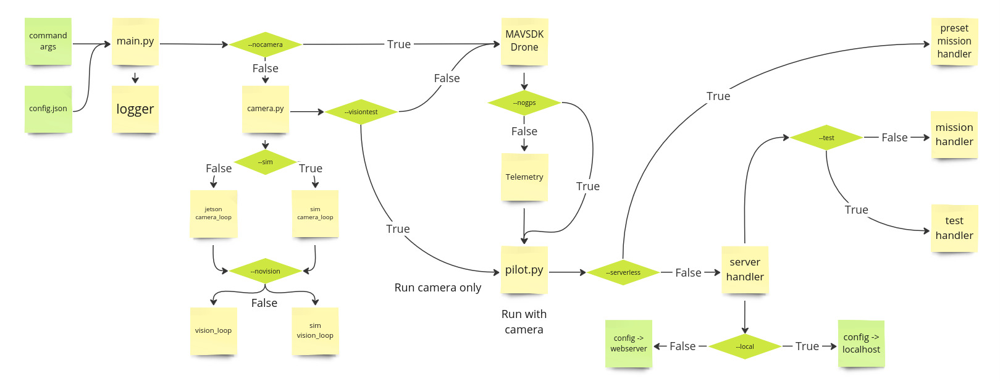

# Needlee Core

### Run with arguments
| Argument     | Description |
| :--- | :------ |
| --nocamera   | Run without camera                           |
| --sim        | Run in simulation                            |
| --novision   | Run without computer vision                  |
| --visiontest | Run vision tests                             |
| --nogps      | Run without gps (dangerous)                  |
| --serverless | Run preset mission without server connection |
| --test       | Run flight tests                             |
| --local      | Run on local server                          |

